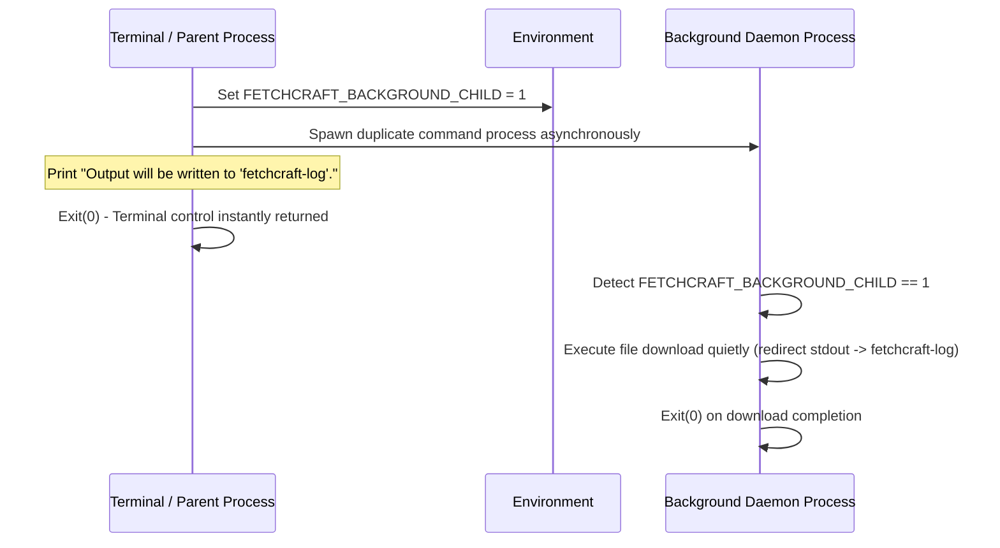
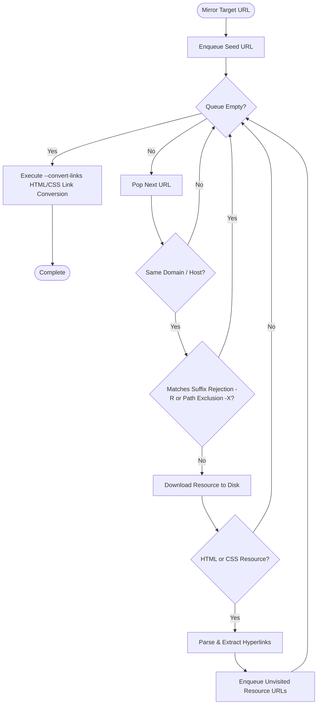

# 🌐 FetchCraft

[](https://go.dev)
[](#-command-line-flags)
[](LICENSE.md)

**FetchCraft** is a non-interactive command-line file retrieval and website mirroring engine written in Go. Supporting HTTP/HTTPS protocols, bandwidth speed limiting, Unix-style daemonization (background execution), concurrent batch downloads, and recursive website mirroring with offline link conversions.

---

## ⚡ Key Highlights

- **Real-Time Progress & ETA Bar**: Live progress reporting with binary size formatting (`KiB`/`MiB`/`GiB`), percentage completion, speed calculations, and estimated time remaining (ETA) using clean ANSI escape sequences.
- **Strict Bandwidth Limiting (`--rate-limit`)**: Rate-limiting reader wrapper throttling throughput with support for `k` (KiB/s) and `M` (MiB/s) units.
- **Background Daemonization (`-B`)**: Detaches execution from the terminal, spawns a background process, and routes logs to `fetchcraft-log`.
- **Concurrent Batch Downloader (`-i`)**: Downloads lists of URLs asynchronously using Go goroutines and waitgroups.
- **Recursive Website Mirroring (`--mirror`)**: Breadth-First Search (BFS) crawler supporting filename suffix rejections (`-R`), path exclusions (`-X`), and relative link conversions (`--convert-links`) for offline browsing.

---

## 📋 Table of Contents

- [Key Highlights](#-key-highlights)
- [System Architecture](#-system-architecture)
- [Background & Mirroring Workflows](#-background--mirroring-workflows)
- [Command Line Flags](#-command-line-flags)
- [Setup & Execution](#-setup--execution)
- [Project Directory Structure](#-project-directory-structure)
- [License](#-license)

---

## 🏗️ System Architecture

```mermaid
graph TD
    A[CLI Input Command] --> B[Config Parser Engine - src/config]
    B --> C{Execution Mode?}
    
    C -- Standard Download --> D[Download Engine - src/download]
    C -- Background Flag -B --> E[Daemon Process Spawner]
    C -- Batch Flag -i --> F[Async Goroutine Worker Pool]
    C -- Mirror Flag --mirror --> G[BFS Web Crawler - src/mirror]
    
    D --> H[Rate-Limited Progress Reader & ANSI Bar]
    F --> H
    E --> I[(fetchcraft-log File Writer)]
    G --> J[Link Converter & Local Disk File System]
```

---

## 🖥️ Live Terminal Execution & Progress Bar Preview

Below is an illustration of FetchCraft downloading a file with real-time rate limiting, live progress bar, throughput speed, and estimated time remaining (ETA):

```text
$ ./fetchcraft --rate-limit=400k https://example.com/data/archive.zip
start at 2026-09-13 03:10:15

sending request, awaiting response... status 200 OK
content length: 20971520 (20.00 MiB) [application/zip]
saving to: 'archive.zip'

 12.45 MiB / 20.00 MiB [=====================>---------------]  62.25% 400.00 KiB/s 19s

2026-09-13 03:10:34 (400.00 KiB/s) - 'archive.zip' saved [20971520/20971520]
```

---

## 📐 Background & Mirroring Workflows

### 1. Background Spawning Sequence (`-B`)



### 2. Website Mirroring Crawl Flow (`--mirror`)



---

## ⚙️ Command Line Flags

| Flag | Description | Example |
| :--- | :--- | :--- |
| `-O` | Saves the downloaded file under a custom target filename. | `-O=archive.zip` |
| `-P` | Saves the downloaded file into a target directory (expands `~`). | `-P=~/Downloads/` |
| `--rate-limit` | Throttles download throughput (`k`/`m` units supported). | `--rate-limit=500k` |
| `-B` | Detaches and runs download in the background (logs to `fetchcraft-log`). | `-B` |
| `-i` | Reads an input file containing multiple URLs for concurrent download. | `-i=urls.txt` |
| `--mirror` | Crawls recursively to mirror a target website locally. | `--mirror` |
| `-R, --reject` | Comma-separated file extension suffixes to skip during mirroring. | `-R=jpg,gif` |
| `-X, --exclude` | Comma-separated path prefixes to exclude during mirroring. | `-X=/assets,/static` |
| `--convert-links` | Rewrites internal links to relative local file paths for offline viewing. | `--convert-links` |

---

## 🚀 Setup & Execution

### Prerequisites

- **Go**: Version 1.20 or newer installed.

---

### Build & Run

1. **Clone Repository**:
   ```bash
   git clone https://github.com/sahmedhusain/fetchcraft.git
   cd fetchcraft
   ```

2. **Compile Executable**:
   ```bash
   go build -o fetchcraft main.go
   ```

3. **Single File Download with Rate Limit**:
   ```bash
   ./fetchcraft --rate-limit=300k https://assets.01-edu.org/wgetDataSamples/20MB.zip
   ```

4. **Background Download**:
   ```bash
   ./fetchcraft -B https://assets.01-edu.org/wgetDataSamples/20MB.zip
   ```

5. **Mirror Website for Offline Browsing**:
   ```bash
   ./fetchcraft --mirror --convert-links -X=/assets https://trypap.com/
   ```

---

## 📂 Project Directory Structure

```
fetchcraft/
├── main.go               # Entrypoint & CLI parser / daemon child spawner
├── go.mod                # Go module manifest (module fetchcraft)
├── README.md             # Documentation
├── getting_started.md    # Detailed test & usage guide
└── src/
    ├── config/           # CLI flag parsing & path expansion
    ├── download/         # File download stream, rate limiter, ANSI progress bar, & async worker pool
    └── mirror/           # BFS crawler, link parser, & relative path link converter
```

---

## 📄 License

Distributed under the MIT License. See [LICENSE](LICENSE.md) for details.