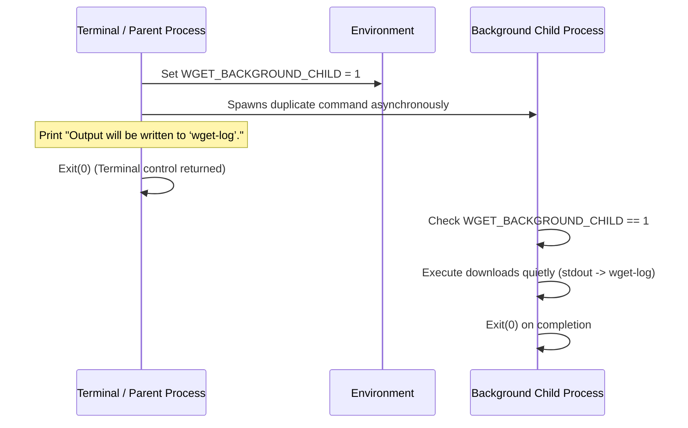
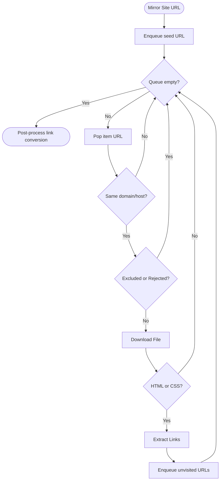

# wget

[](https://go.dev)
[](#-usage)
[](LICENSE.md)

<p align="center">
	
	
</p>

**wget** is a command-line terminal utility written in Go for non-interactive downloads of files from the web. It supports HTTP/HTTPS protocols, bandwidth speed limiting, Unix-style daemonization (background downloading), concurrent batch downloads, and recursive website mirroring with offline link conversion.

---

## ⚡ What's cool about it?

- **Real-time Progress Bar**: Displays download stats in real-time. Features include binary size formatting (`KiB`/`MiB`/`GiB`), a smooth progress bar, percentage completion, live speed tracker, and estimated time remaining (ETA). Uses carriage return updates (`\r`) along with ANSI clear escape sequences (`\u001b[K`) to prevent terminal trailing character glitches.
- **Strict Bandwidth Limiting**: Control the speed of the download using `--rate-limit` with support for `k` (KiB) and `M` (MiB) units (e.g. `--rate-limit=300k`).
- **Unix-style Backgrounding (`-B`)**: Runs the download task in the background by daemonizing itself, writing a clean execution trace to `wget-log` and releasing control of the terminal instantly.
- **Asynchronous Concurrent Downloads (`-i`)**: Reads a list of URLs from an input file and downloads them concurrently using Go's lightweight goroutines and waitgroups, showing sorted sizes and progress milestones.
- **Robust Website Mirroring (`--mirror`)**: Crawls pages recursively using a BFS queue within the same domain. Supports filename suffix rejection (`-R`), directory exclusion (`-X`), and offline link conversion (`--convert-links`) for both HTML and CSS files.

---

## 📋 Table of Contents

- [What's cool about it?](#-whats-cool-about-it)
- [Available Flags](#%EF%B8%8F-available-flags)
- [Quick Tour & Usage](#-quick-tour--usage)
- [How the code works](#-how-the-code-works)
- [Running the tool locally](#-running-the-tool-locally)
- [Project Files](#-project-files)
- [License](#-license)

---

## ⚙️ Available Flags

| Flag | Description | Example |
| :--- | :--- | :--- |
| `-O` | Saves the downloaded file under a custom name. | `-O=meme.jpg` |
| `-P` | Saves the downloaded file in a custom directory (handles `~` expansion). | `-P=~/Downloads/` |
| `--rate-limit` | Throttles download speed (supports `k`/`K` for KiB/s, `m`/`M` for MiB/s). | `--rate-limit=300k` |
| `-B` | Detaches and runs the download in the background (logs to `wget-log`). | `-B` |
| `-i` | Reads an input file to download multiple URLs concurrently. | `-i=downloads.txt` |
| `--mirror` | Crawls recursively to mirror a website locally under a domain folder. | `--mirror` |
| `-R, --reject` | Suffixes of files to reject and avoid downloading during mirroring. | `-R=jpg,gif` |
| `-X, --exclude` | Directory path prefixes to exclude and skip during mirroring. | `-X=/js,/assets` |
| `--convert-links` | Rewrites links in downloaded pages to point to local relative files. | `--convert-links` |

---

## 🧭 Quick Tour & Usage

### 1. Basic Download
Downloads a file to the current directory with its original filename.
```bash
./wget https://pbs.twimg.com/media/EMtmPFLWkAA8CIS.jpg
```

### 2. Rename & Save Directory (`-O` and `-P`)
Downloads a file, renames it to `meme.jpg`, and saves it inside the `~/Downloads/` directory (expanding the home directory path automatically).
```bash
./wget -O=meme.jpg -P=~/Downloads/ https://pbs.twimg.com/media/EMtmPFLWkAA8CIS.jpg
```

### 3. Bandwidth Rate Limiting (`--rate-limit`)
Limits the download speed to a maximum of 300 KiB/s.
```bash
./wget --rate-limit=300k https://assets.01-edu.org/wgetDataSamples/20MB.zip
```

### 4. Background Downloading (`-B`)
Detaches from the terminal, runs the download in the background, and logs status changes to `wget-log`.
```bash
./wget -B https://assets.01-edu.org/wgetDataSamples/20MB.zip
```

### 5. Asynchronous Batch Downloader (`-i`)
Downloads all links listed in a text file concurrently.
```bash
./wget -i=downloads.txt
```

### 6. Website Mirroring (`--mirror` with exclusions and conversions)
Crawls and mirrors `trypap.com`, excluding the `/img` path, and converts links to point to local resources for offline browsing.
```bash
./wget --mirror -X=/img --convert-links https://trypap.com/
```

---

## 🏗 How the code works

### 📊 Program Flows

#### 1. Background Spawning Sequence
Spawning a background process detaches control from the terminal:



#### 2. Mirroring Crawl Flow
Recursive BFS crawl for mirroring sites:



---

### 💻 Key Code Snippets

#### 1. Rate Limiting Reader Wrapper
We restrict bandwidth by calculating the time that should have elapsed for the bytes downloaded under the target speed. If the download is running too fast, the reader sleeps to throttle the rate:
```go
func (pr *DownloadProgressReader) Read(p []byte) (int, error) {
	n, err := pr.reader.Read(p)
	if n > 0 {
		pr.downloaded += int64(n)

		if pr.rateLimit > 0 {
			now := time.Now()
			elapsed := now.Sub(pr.startTime)
			expected := time.Duration(float64(pr.downloaded) / float64(pr.rateLimit) * float64(time.Second))
			if elapsed < expected {
				time.Sleep(expected - elapsed)
			}
		}
		// Progress bar updates...
	}
	return n, err
}
```

#### 2. Relative Link Calculation
To convert absolute URLs or paths to relative links for offline viewing, we compute the relative path between the directory of the current HTML/CSS file and the target resource:
```go
// Calculate relative path from current HTML dir to target asset
relPath, err := filepath.Rel(filepath.Dir(currentHTMLPath), targetAssetPath)
if err == nil {
	node.Val = filepath.ToSlash(relPath)
}
```

---

## 🚀 Running the tool locally

### Setup
Ensure you have the Go compiler installed (version 1.20 or newer). Verify your installation:
```bash
go version
```

### Build
Compile the codebase into a single executable `wget`:
```bash
go build -o wget
```

---

## 📁 Project Files

- `main.go` — Entrypoint, parses CLI configuration, and spawns the background child process if `-B` is specified.
- `src/` — Core modules:
  - `config/config.go` — Parses and validates command-line arguments and flags, and expands home directories (`~`).
  - `download/download.go` — Orchestrates file downloads, timings, content size formatting, and file system creations.
  - `download/progressbar.go` — Handles progress bar updates, speeds, ETA calculations, and rate limiting.
  - `download/async.go` — Coordinates asynchronous concurrent downloads for the `-i` flag.
  - `mirror/mirror.go` — Implements BFS website crawling, rejections (`-R`), exclusions (`-X`), and offline link conversions.
- `getting_started.md` — Detailed setup instructions and step-by-step verification flows.

---

## 👥 Authors

- Sayed Ahmed Husain
- Salah Yuksel 

MIT licensed (see `LICENSE.md`). Have fun downloading!